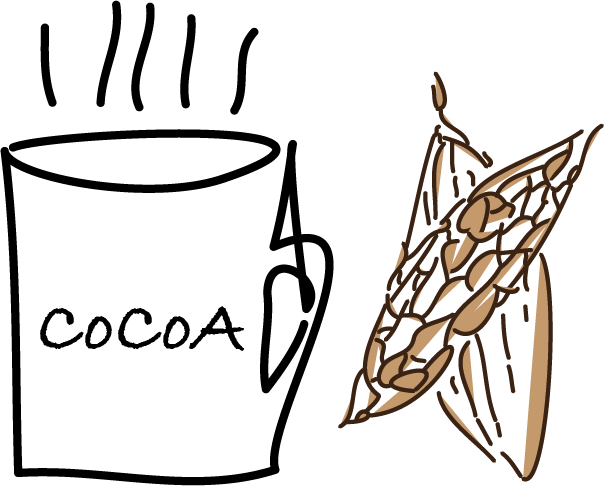

### Required software

[Matrix Market Utility](https://github.com/ypark/mmutil)

### Source code for this repository 

[COCOA Paper](https://github.com/ypark/cocoa_paper)

### Counterfactual Confounder Adjustment (CoCoA) for single-cell RNA-seq differential expression analysis

(Logo by Elise Park)

#### Simulation experiments

* [Simulation results focusing on power comparison (Fig. 2, Supplementary Fig. 1)](result_simulation-power.html)

* [Simulation results focusing on sample size](result_simulation-samplesize.html)

* [Simulation results testing empirical FDR (Fig. 2, Supplementary Fig. 1)](result_simulation-fdr.html)

* [Simulating results testing the sensitivity of kNN parameters (Fig. 2, Supplementary Fig. 1)](result_simulation-knn.html)

* [Simulation results used in Supplementary Fig. 2](result_simulation-v3.html)

#### Alzheimer's disease case study

* [Differential Expression Analysis (Fig. 3)](result_AD.html)

* [Gene ontology enrichment for DEGs (Fig. 4)](result_AD_GO.html)

